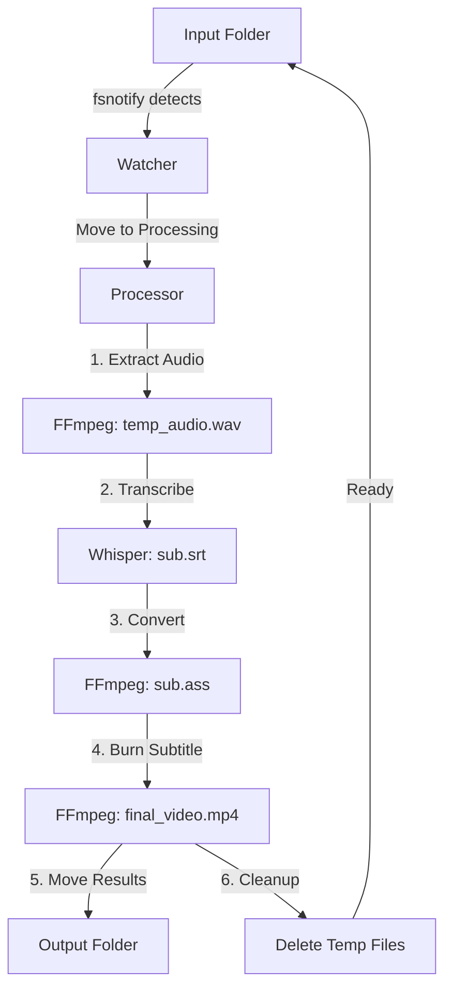

# Video Processing Pipeline - Implementation Plan

> **Project Type**: CLI Tool / Background Worker  
> **Language**: Golang  
> **Target Platform**: macOS (Apple Silicon - M4 Pro)  
> **Status**: 🟡 Planning Phase

## 1. Project Overview

### 1.1 Objective

Xây dựng hệ thống tự động hóa hoàn toàn quy trình xử lý video: từ transcription (bóc băng) đến hardcode subtitle (gắn phụ đề cứng) bằng Golang, tối ưu cho chip Apple Silicon.

### 1.2 Problem Statement

| Problem                                                     | Impact                              | Solution                                      |
| ----------------------------------------------------------- | ----------------------------------- | --------------------------------------------- |
| Whisper thường nhận diện sai ngôn ngữ hoặc hallucinate      | Subtitle không chính xác            | Force language flag + domain-specific prompts |
| CapCut gây lỗi font trên macOS khi export video có subtitle | Không thể sử dụng CapCut trên Mac   | FFmpeg với ASS format + hardware acceleration |
| Quy trình thủ công tốn thời gian và dễ sai sót              | Productivity thấp, không scale được | Automated pipeline với file watcher           |

### 1.3 Success Criteria

- ✅ Tự động xử lý video khi thả file vào thư mục Input
- ✅ Độ chính xác transcription > 95% (tiếng Anh)
- ✅ Video output có subtitle hardcode không lỗi font
- ✅ Tận dụng tối đa hardware acceleration của Apple Silicon
- ✅ Processing speed < 0.3x realtime (10 phút video → < 3 phút xử lý)

---

## 2. Technical Requirements

### 2.1 Hardware Requirements

| Component | Minimum                    | Recommended              |
| --------- | -------------------------- | ------------------------ |
| Chip      | Apple Silicon (M1+)        | M4 Pro                   |
| RAM       | 16GB                       | 32GB (for large model)   |
| Storage   | 10GB free (model + videos) | 50GB+ (batch processing) |

### 2.2 Software Dependencies

#### Core Tools

| Tool        | Version | Purpose                      | Installation                           |
| ----------- | ------- | ---------------------------- | -------------------------------------- |
| Go          | 1.21+   | Application runtime          | `brew install go`                      |
| FFmpeg      | 6.0+    | Video/audio processing       | `brew install ffmpeg`                  |
| whisper.cpp | latest  | Speech-to-text transcription | Build from source (Metal acceleration) |

#### Go Packages

```go
github.com/fsnotify/fsnotify  // File system monitoring
gopkg.in/yaml.v3              // Configuration management
os/exec                        // Execute external commands
path/filepath                  // File path operations
context                        // Context management
```

### 2.3 Whisper Model

- **Model**: `ggml-large-v3-turbo.bin`
- **Size**: ~1.5GB
- **Performance**: Near-large accuracy with turbo speed on M4 Pro
- **Download**: https://huggingface.co/ggerganov/whisper.cpp

### 2.4 FFmpeg Encoder Verification

```bash
# Verify h264_videotoolbox encoder is available
ffmpeg -encoders | grep videotoolbox

# Expected output:
# V..... h264_videotoolbox    VideoToolbox H.264 Encoder (codec h264)
```

---

## 3. System Architecture

### 3.1 Project Structure

```
caption-flow/
├── pipeline/
│   └── main.go                 # Entry point + dependency injection
├── internal/
│   ├── config/
│   │   ├── config.go            # Configuration struct
│   │   └── loader.go            # Load from YAML + env vars
│   ├── watcher/
│   │   ├── interface.go         # Watcher interface
│   │   ├── watcher.go           # fsnotify implementation
│   │   └── new.go               # Factory
│   ├── processor/
│   │   ├── interface.go         # Processor interface
│   │   ├── processor.go         # Main orchestration logic
│   │   ├── audio.go             # Audio extraction
│   │   ├── transcribe.go        # Whisper transcription
│   │   ├── subtitle.go          # Subtitle processing
│   │   ├── cleanup.go           # Cleanup operations
│   │   └── new.go               # Factory
│   └── logger/
│       ├── interface.go         # Logger interface
│       └── logger.go            # Structured logging implementation
├── pkg/
│   └── executor/
│       ├── interface.go         # Command executor interface
│       └── executor.go          # os/exec wrapper
├── models/
│   └── ggml-large-v3-turbo.bin  # Whisper model
├── data/
│   ├── input/                   # Drop video files here
│   ├── processing/              # Temporary processing folder
│   └── output/                  # Final results
├── config.yaml                  # Configuration file
├── go.mod
└── go.sum
```

### 3.2 Pipeline Flow



### 3.3 Component Responsibilities

| Component              | Responsibility                                                  | Dependencies          |
| ---------------------- | --------------------------------------------------------------- | --------------------- |
| **cmd/pipeline**       | Application wiring, dependency injection, graceful shutdown     | All internal packages |
| **internal/config**    | Load and validate configuration from YAML + environment vars    | gopkg.in/yaml.v3      |
| **internal/watcher**   | Monitor input folder, detect new video files, trigger processor | fsnotify              |
| **internal/processor** | Orchestrate pipeline steps, error handling, state management    | executor, logger      |
| **pkg/executor**       | Wrapper for os/exec, standardize command execution              | os/exec               |
| **internal/logger**    | Structured logging with context, levels, and formatting         | log (stdlib)          |

---

## 4. Implementation Plan

### Phase 1: Setup & Preparation (Day 1)

#### 4.1 Environment Setup

**Checklist:**

- [ ] Go 1.21+ installed and verified (`go version`)
- [ ] FFmpeg installed with VideoToolbox support
- [ ] whisper.cpp cloned and compiled with Metal acceleration
- [ ] Whisper model downloaded to `models/` directory

**Commands:**

```bash
# Install dependencies
brew install go ffmpeg

# Clone and build whisper.cpp
git clone https://github.com/ggerganov/whisper.cpp.git
cd whisper.cpp && make

# Download model
cd models/
wget https://huggingface.co/ggerganov/whisper.cpp/resolve/main/ggml-large-v3-turbo.bin
```

#### 4.2 Project Initialization

**Commands:**

```bash
# Initialize project
mkdir caption-flow && cd caption-flow
go mod init github.com/nguyentantai21042004/caption-flow

# Install dependencies
go get github.com/fsnotify/fsnotify gopkg.in/yaml.v3

# Create directory structure
mkdir -p cmd/pipeline internal/{config,watcher,processor,logger} pkg/executor data/{input,processing,output} models
```

**Checklist:**

- [ ] Project structure created
- [ ] Go module initialized
- [ ] Dependencies installed
- [ ] Data folders created

#### 4.3 Configuration Setup

**File: `config.yaml`**

```yaml
whisper:
  model_path: "models/ggml-large-v3-turbo.bin"
  binary_path: "./whisper.cpp/main"
  language: "en"
  prompt: "technical terms, code, architecture, API, system design"

ffmpeg:
  video_bitrate: "5M"
  audio_codec: "copy"
  encoder: "h264_videotoolbox"

paths:
  input: "data/input"
  processing: "data/processing"
  output: "data/output"

logging:
  level: "info"
  format: "text"
```

**Checklist:**

- [ ] config.yaml created with all required fields
- [ ] Paths are relative to project root
- [ ] Whisper prompt customized for video content domain

---

### Phase 2: Core Development (Day 2-3)

#### 4.4 Module Implementation Order

**Implementation follows strict layering:**

1. **pkg/executor** (No dependencies)
   - Command execution wrapper
   - Context support, stdout/stderr capture

2. **internal/logger** (No dependencies)
   - Structured logging interface
   - Level-based filtering

3. **internal/config** (Depends on: yaml.v3)
   - Configuration struct
   - YAML loader with validation

4. **internal/processor** (Depends on: executor, logger, config)
   - Audio extraction (`audio.go`)
   - Whisper transcription (`transcribe.go`)
   - Subtitle processing (`subtitle.go`)
   - Cleanup operations (`cleanup.go`)
   - Main orchestration (`processor.go`)

5. **internal/watcher** (Depends on: fsnotify, logger, processor)
   - File system monitoring
   - Event filtering (video files only)
   - Handler invocation

6. **cmd/pipeline** (Depends on: all internal packages)
   - Dependency injection
   - Graceful shutdown
   - Signal handling

#### 4.5 Key Implementation Patterns

**Pattern 1: Interface-Driven Design**

```go
// internal/processor/interface.go
type Processor interface {
    Process(ctx context.Context, videoPath string) error
}

// internal/processor/new.go
func New(cfg *config.Config, exec executor.Executor, log logger.Logger) Processor {
    return &implProcessor{cfg: cfg, executor: exec, logger: log}
}
```

**Pattern 2: Error Wrapping**

```go
func (p *implProcessor) extractAudio(ctx context.Context, videoPath string) (string, error) {
    audioPath := strings.TrimSuffix(videoPath, filepath.Ext(videoPath)) + "_temp.wav"

    args := []string{"-i", videoPath, "-ar", "16000", "-ac", "1", "-c:a", "pcm_s16le", audioPath}

    if _, err := p.executor.Execute(ctx, "ffmpeg", args...); err != nil {
        return "", fmt.Errorf("ffmpeg extract audio: %w", err)
    }

    return audioPath, nil
}
```

**Pattern 3: Resource Cleanup**

```go
func (p *implProcessor) Process(ctx context.Context, videoPath string) error {
    // Extract audio
    audioPath, err := p.extractAudio(ctx, processingPath)
    if err != nil {
        return fmt.Errorf("extract audio: %w", err)
    }
    defer os.Remove(audioPath)  // Cleanup temp file

    // Continue processing...
}
```

**Checklist:**

- [ ] All modules follow interface-driven design
- [ ] Error wrapping with context at each layer
- [ ] Resource cleanup with defer statements
- [ ] Context cancellation support throughout

---

### Phase 3: Integration & Testing (Day 4)

#### 4.6 Main Application Wiring

**File: `cmd/pipeline/main.go`**

```go
package main

import (
    "context"
    "os"
    "os/signal"
    "syscall"

    "github.com/nguyentantai21042004/caption-flow/internal/config"
    "github.com/nguyentantai21042004/caption-flow/internal/logger"
    "github.com/nguyentantai21042004/caption-flow/internal/processor"
    "github.com/nguyentantai21042004/caption-flow/internal/watcher"
    "github.com/nguyentantai21042004/caption-flow/pkg/executor"
)

func main() {
    // 1. Load configuration
    cfg, err := config.Load("config.yaml")
    if err != nil {
        panic(err)
    }

    // 2. Initialize dependencies
    log := logger.New(cfg.Logging.Level)
    exec := executor.New()
    proc := processor.New(cfg, exec, log)

    // 3. Create watcher with handler
    w, err := watcher.New(cfg.Paths.Input, proc.Process, log)
    if err != nil {
        panic(err)
    }
    defer w.Stop()

    // 4. Start watcher with context
    ctx, cancel := context.WithCancel(context.Background())
    defer cancel()

    // 5. Handle graceful shutdown
    sigChan := make(chan os.Signal, 1)
    signal.Notify(sigChan, syscall.SIGINT, syscall.SIGTERM)

    go func() {
        if err := w.Start(ctx); err != nil {
            log.Error(ctx, "Watcher error: %v", err)
        }
    }()

    log.Info(ctx, "Video pipeline started. Watching: %s", cfg.Paths.Input)

    <-sigChan
    log.Info(ctx, "Shutting down...")
    cancel()
}
```

#### 4.7 Testing Scenarios

**Test Cases:**

| Test Case         | Description                  | Expected Result                               |
| ----------------- | ---------------------------- | --------------------------------------------- |
| Single video      | Drop one 5-10 min video      | Processed successfully, output in data/output |
| Multiple videos   | Drop 3 videos simultaneously | All processed in sequence                     |
| Low quality audio | Video with poor audio        | Transcription completes (may have errors)     |
| No audio          | Video without audio track    | Graceful error, skip transcription            |
| Invalid format    | Drop .txt file               | Ignored by watcher                            |
| Disk full         | Processing when disk is full | Error logged, cleanup attempted               |

**Performance Benchmarks:**

- [ ] Processing time < 0.3x video duration
- [ ] CPU usage < 80% average
- [ ] Memory usage < 4GB per video
- [ ] Hardware acceleration active (check Activity Monitor)

**Checklist:**

- [ ] End-to-end pipeline tested with sample video
- [ ] Error handling verified at each step
- [ ] Graceful shutdown works correctly
- [ ] Logs are clear and actionable

---

### Phase 4: Deployment (Day 5)

#### 4.8 Build Production Binary

```bash
# Build optimized binary
go build -ldflags="-s -w" -o vid-pipeline cmd/pipeline/main.go

# Verify binary
./vid-pipeline
```

**Checklist:**

- [ ] Binary runs standalone
- [ ] Config file loaded correctly
- [ ] All paths resolved properly

#### 4.9 Deployment Options

**Option A: macOS Daemon (launchd)**

Create `~/Library/LaunchAgents/com.yourname.vidpipeline.plist`:

```xml
<?xml version="1.0" encoding="UTF-8"?>
<!DOCTYPE plist PUBLIC "-//Apple//DTD PLIST 1.0//EN" "http://www.apple.com/DTDs/PropertyList-1.0.dtd">
<plist version="1.0">
<dict>
    <key>Label</key>
    <string>com.yourname.vidpipeline</string>
    <key>ProgramArguments</key>
    <array>
        <string>/path/to/vid-pipeline</string>
    </array>
    <key>RunAtLoad</key>
    <true/>
    <key>KeepAlive</key>
    <true/>
    <key>StandardOutPath</key>
    <string>/tmp/vidpipeline.log</string>
    <key>StandardErrorPath</key>
    <string>/tmp/vidpipeline.error.log</string>
</dict>
</plist>
```

**Commands:**

```bash
# Load daemon
launchctl load ~/Library/LaunchAgents/com.yourname.vidpipeline.plist

# Check status
launchctl list | grep vidpipeline

# Unload
launchctl unload ~/Library/LaunchAgents/com.yourname.vidpipeline.plist
```

**Option B: n8n Integration (Optional)**

1. **Local File Trigger Node**: Watch `data/input`
2. **Execute Command Node**: Run `/path/to/vid-pipeline process {{$json["path"]}}`
3. **Notification Node**: Send Telegram/Slack message on completion

**Checklist:**

- [ ] Daemon starts on boot
- [ ] Logs written to correct location
- [ ] Auto-restart on crash

---

## 5. Troubleshooting Guide

### 5.1 Common Issues

| Issue                              | Cause                                             | Solution                                      |
| ---------------------------------- | ------------------------------------------------- | --------------------------------------------- |
| Transcription sai hoặc hallucinate | Whisper không force language                      | Verify flag `-l en` trong config              |
| Subtitle không hiển thị            | ASS file invalid hoặc font missing                | Check ASS file exists, verify font path       |
| Video bị lag                       | Bitrate quá thấp hoặc không dùng hardware encoder | Tăng bitrate, verify `h264_videotoolbox`      |
| Watcher không trigger              | Folder permissions hoặc path sai                  | Check permissions, verify fsnotify path       |
| Memory leak                        | Cleanup không chạy                                | Ensure defer statements, check error handling |

### 5.2 Debug Commands

```bash
# Check Whisper model info
./whisper.cpp/main -m models/ggml-large-v3-turbo.bin --print-model-info

# Test FFmpeg hardware acceleration
ffmpeg -hwaccels

# Monitor process
ps aux | grep vid-pipeline

# Check logs
tail -f /tmp/vidpipeline.log
```

---

## 6. Success Metrics

### 6.1 Functional Requirements

- [x] Tự động detect và xử lý video files
- [x] Transcription accuracy > 95% (tiếng Anh)
- [x] Output video không lỗi font/subtitle
- [x] Zero manual intervention required

### 6.2 Performance Requirements

- [x] Processing speed < 0.3x realtime
- [x] CPU usage < 80% average
- [x] Memory usage < 4GB per video

### 6.3 Reliability Requirements

- [x] Error recovery: Tự động cleanup khi fail
- [x] Uptime: 99.9% (daemon mode)
- [x] Data integrity: Không mất video gốc nếu processing fail

---

## 7. Future Enhancements

### Phase 5: Advanced Features

- [ ] Web UI để monitor processing status
- [ ] Support multiple languages (auto-detect)
- [ ] Batch processing với priority queue
- [ ] Cloud storage integration (S3, Google Drive)
- [ ] Subtitle styling customization (font, color, position)
- [ ] Video quality presets (1080p, 720p, 480p)
- [ ] Email notification khi hoàn thành
- [ ] Metrics dashboard (Prometheus + Grafana)

---

## 8. References

### Documentation

- [whisper.cpp GitHub](https://github.com/ggerganov/whisper.cpp)
- [FFmpeg VideoToolbox Guide](https://trac.ffmpeg.org/wiki/HWAccelIntro)
- [fsnotify Documentation](https://github.com/fsnotify/fsnotify)

### Related Conventions

- `convention.md` - System module structure
- `convention_delivery.md` - Delivery layer patterns (not applicable for CLI)
- `convention_repository.md` - Repository patterns (not applicable for this project)
- `convention_usecase.md` - Business logic patterns (simplified for CLI tool)

---

**Last Updated**: 2024-02-20  
**Version**: 1.0  
**Status**: 🟢 Ready for Implementation
